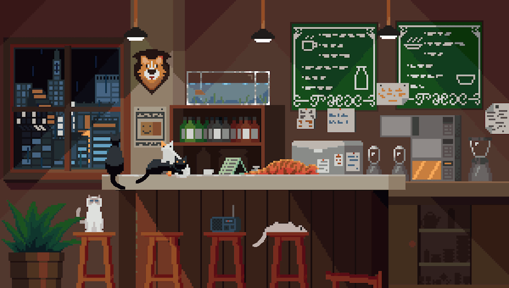

# Bonjour ici !

###### Je suis Olivier, un étudiant français en 2ème année de CPGE (Maths spé). J'aimerais travailler comme ingénieur Systèmes Électroniques Embarqués : en R&D dans le domaine de l'automobile ou de l'aérospatial. **Bienvenue dans  le "Doomland of unfinished projects"**

---
```
Note aux équipes de recruttement :
Ce github héberge des projets depuis ~2020. Il n'est pas très professionnel mais reflète plutôt bien mon engouement pour les projets d'informatique et d'électronique.
```
---
### Parcours éducatif :
J'ai eu mon bac avec les spécialités mathématiques et informatique en 2024. J'ai eu l'occasion de participer au concours général de NSI, et à des événements de code comme [CodingUp][https://codingup.fr/]. Je suis maintenant en deuxième année de CPGE MPI à Poitiers.


---
<div align="center">

</div>
