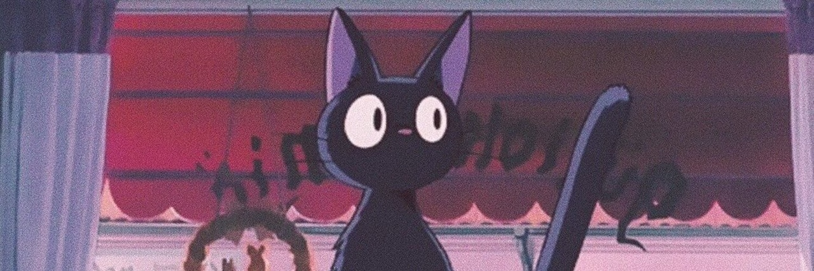
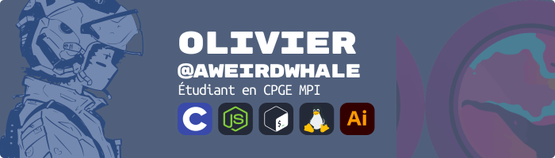

<!---->
<div align="center">

</div>


# Bonjour ici !

#### Je suis Olivier, un étudiant français en 2ème année de CPGE (Maths spé). J'aimerais travailler comme ingénieur Systèmes Électroniques Embarqués : en R&D dans le domaine de l'automobile ou de l'aérospatial. 
**Bienvenue dans  le "Doomland of unfinished projects"** :

---

<div align="center">

</div>

---
### Parcours éducatif :
J'ai eu mon bac avec les spécialités mathématiques et informatique en 2024. J'ai eu l'occasion de participer au concours général de NSI, et à des événements de code comme [CodingUp](https://codingup.fr/). Je suis maintenant en deuxième année de CPGE en MPI à Poitiers. J'espère pouvoir rejoindre une école d'ingénieurs en Alternance, dans le domaine des **Systèmes Électroniques Embarqués**


Vous trouverez si-dessous une selection de projets personnels ou scolaires

---

```
credits :
carbon.now.sh
transhumans.xyz
```

